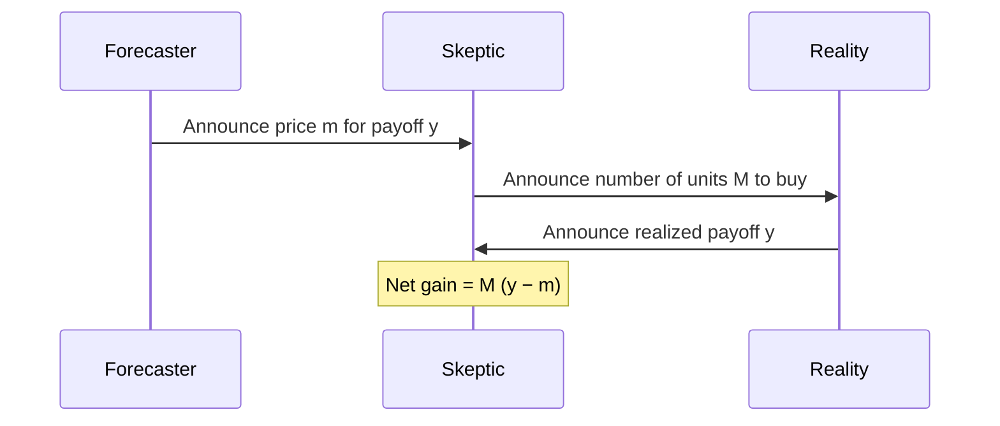

Markets have liqudity, that is equal to resting orders already on the order book:

* **Order book depth** measures how much volume is available at or near the current price without causing significant price movement.
* **Bid–ask spread** measures the immediate cost of trading by comparing the best available buy and sell prices.
* **Slippage (price impact)** measures how much the execution price worsens as trade size increases.
* **Maker vs. taker volume** measures whether trades are primarily adding liquidity (makers) or removing it (takers).
* **Time to fill** measures how long passive limit orders typically wait before being executed.
* **Trading volume over time** measures overall market activity and participation, which indirectly reflects liquidity.

---

---

# Problem Definition: Detection of Informed Trading via Market Actions

**Given:**
A sequence of independent events, each with a finite set of possible outcomes. For a targeted bettor, we observe their historical log of market transactions leading up to the resolution of these events. The available data is strictly limited to the realized outcomes and a sequence of transaction tuples, where each transaction consists of:

* **Action:** BUY or SELL for a specific outcome.
* **Price ($p$):** The execution price of the trade, which directly represents the publicly available probability of that outcome at that specific time.
* **Quantity ($q$):** The volume of contracts transacted.
* **Resolution:** The single actualized outcome for each event.

**The Problem:**
To determine, using strictly the provided transaction log and the realized outcomes, whether the targeted bettor possesses private (insider) information. Specifically, the task requires:

1. Assessing whether the bettor's realized profit trajectory—derived entirely from the (Action, Price, Quantity) data—is statistically consistent with chance under the publicly known probabilities, or if it exhibits systematic deviations.
2. Quantifying the strength of the evidence indicating an informational edge.
3. Calculating the statistical confidence with which the presence of private information can be inferred.

## Solutions

### Berniulli approach

For event $i$, there are publicly known probabilities (known to everyone) $$p_{ij}, \quad \sum_j p_{ij} = 1,$$ the true outcome or the result modeled with a random variable is $$X_{ij} = 1 \text{ if outcome $j$ occurs else } 0.$$

For a regular bettor this holds perfectly $E(X_{ij} | \text{bettor}) = 1 \cdot p_{i,j} + 0 \cdot (1 - p_{i,j}) = p_{ij}$. But for a bettor who has an edge this is not true, $$E(X_{ij} | \text{bettor with edge}) = p_{ij} + \underbrace{\delta_{ij}}_\text{edge}.$$

The first equation should be true for all bettors who don't have an edge and this gives us a quantifyable measure, $E(X_{i,\text{chosen}}) - p_{i,\text{chosen}} = E(X_{i,\text{chosen}} - p_{i,\text{chosen}}) = 0$ (for informed bettors this doesn't equal 0).

This is a bad approach since it doesn't take into account the bet sizes, someone knowing the method could take advantage of this and purpusfully mascarade their knowledge.

# TODOS:
- [] Train an xgboost model for predicting up and down probability (create a notebook for this)
- [] Size bets depending on the edge (and total money available)
- [] Don't wait till the end of the market to resolve
- [] Don't just execute at a specific timestep, execute when there's an edge
